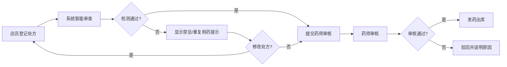

## 1. 产品概述

药店智慧零售Web平台，面向连锁药房运营人员、店员和质管人员，提供一体化的销售、处方、会员、库存、慢病、促销、合规管理解决方案。通过数字化手段提升药房运营效率，保障用药安全，优化会员服务体验。

## 2. 核心功能

### 2.1 用户角色

| 角色 | 登录方式 | 核心权限 |
|------|----------|----------|
| 运营人员 | 账号密码登录 | 查看经营看板、管理促销活动、查看销售报表、导出质管台账 |
| 店员 | 账号密码登录 | 处方登记、会员服务、库存查询、慢病随访记录 |
| 质管人员 | 账号密码登录 | 处方审核、合规检查、效期管理、冷链温度记录 |

### 2.2 功能模块

1. **经营看板**：门店销售数据、客流统计、复购率分析、销售趋势图
2. **处方审核**：处方信息登记、药师审核、禁忌提示、重复用药预警
3. **会员服务**：会员信息查询、购药记录、用药提醒设置
4. **库存效期**：效期预警、近效期处理清单、库存查询
5. **慢病随访**：慢病档案维护、随访记录、用药依从性跟踪
6. **促销活动**：组合促销创建、处方药促销限制、促销效果统计
7. **合规检查**：门店自查发起、整改照片上传、质管台账导出

### 2.3 页面详情

| 页面名称 | 模块名称 | 功能描述 |
|----------|----------|----------|
| 经营看板 | 销售概览 | 今日销售额、订单数、客单价统计卡片 |
| 经营看板 | 客流分析 | 日/周/月客流量趋势图表、时段分布 |
| 经营看板 | 复购统计 | 会员复购率、品类复购排行 |
| 处方审核 | 处方登记 | 患者信息、药品列表、诊断信息录入 |
| 处方审核 | 智能审查 | 药物禁忌检测、重复用药提示、剂量校验 |
| 处方审核 | 审核工作台 | 待审核处方列表、审核通过/驳回操作 |
| 会员服务 | 会员查询 | 手机号/会员号搜索、会员基本信息展示 |
| 会员服务 | 购药记录 | 历史购药清单、消费金额统计 |
| 会员服务 | 用药提醒 | 提醒时间设置、提醒方式选择 |
| 库存效期 | 效期预警 | 近效期药品列表、有效期倒计时 |
| 库存效期 | 处理清单 | 生成近效期处理单、促销/退货/报损选项 |
| 库存效期 | 库存查询 | 药品库存、批次信息 |
| 慢病随访 | 慢病档案 | 高血压/糖尿病等慢病患者档案 |
| 慢病随访 | 随访记录 | 随访时间、血压/血糖数据、用药情况 |
| 慢病随访 | 依从性分析 | 用药依从率、漏服提醒 |
| 促销活动 | 活动创建 | 满减/折扣/买赠等促销规则配置 |
| 促销活动 | 商品配置 | 参与商品选择、处方药促销限制提示 |
| 促销活动 | 效果统计 | 活动销量、销售额、客单价对比 |
| 合规检查 | 自查管理 | 自查项目清单、自查任务发起 |
| 合规检查 | 整改管理 | 问题记录、整改照片上传、整改审核 |
| 合规检查 | 台账导出 | 质管记录统计、Excel导出 |

## 3. 核心流程

### 3.1 处方审核流程
店员登记处方信息 → 系统智能检测禁忌/重复用药 → 药师人工审核 → 审核通过发药 / 驳回说明原因

### 3.2 效期管理流程
系统自动识别近效期药品 → 生成效期预警清单 → 管理人员选择处理方式（促销/退货/报损）→ 跟踪处理结果

### 3.3 合规检查流程
质管人员发起自查任务 → 门店对照检查项自查 → 发现问题上传整改照片 → 质管人员审核整改 → 生成质管台账

## 4. 用户界面设计

### 4.1 设计风格
- **主色调**：医疗蓝 (#165DFF)，体现专业、可信的医疗行业属性
- **辅助色**：健康绿 (#00B42A) 用于通过/正常状态，警示橙 (#FF7D00) 用于预警，危险红 (#F53F3F) 用于禁忌/错误
- **中性色**：深灰 (#1D2129) 用于正文，中灰 (#4E5969) 用于辅助文字，浅灰 (#F2F3F5) 用于背景
- **按钮风格**：圆角 8px，主按钮实心蓝，次要按钮描边蓝
- **字体**：中文使用 PingFang SC，数字使用 DIN 等宽字体，提升数据可读性
- **布局风格**：左侧导航 + 顶部操作栏 + 内容卡片式布局
- **图标风格**：线性图标，2px 线条，圆角端点

### 4.2 页面设计概览

| 页面名称 | 模块名称 | UI 元素 |
|----------|----------|---------|
| 经营看板 | 销售概览 | 渐变统计卡片、数字放大动画、趋势小箭头 |
| 经营看板 | 数据图表 | ECharts 折线图/柱状图、悬停交互、数据钻取 |
| 处方审核 | 处方表单 | 分步表单、药品选择器、智能提示浮层 |
| 处方审核 | 审核列表 | 状态标签、紧急程度标记、一键审核 |
| 会员服务 | 会员详情 | 头像卡片、标签云、时间轴购药记录 |
| 库存效期 | 预警列表 | 效期进度条、颜色分级（红/橙/黄） |
| 慢病随访 | 档案卡片 | 患者头像、健康指标仪表盘、趋势图 |
| 促销活动 | 活动配置 | 规则可视化配置、实时预览效果 |
| 合规检查 | 整改记录 | 照片墙、时间线、状态流转 |

### 4.3 响应式设计
- Desktop-first 设计，适配 1366px 及以上分辨率
- 侧边导航可折叠，适配小屏幕显示
- 表格支持横向滚动，保证数据完整展示
- 按钮点击区域不小于 44px，兼顾触屏操作

### 4.4 动效设计
- 页面切换：淡入 + 轻微上移动画，时长 300ms
- 数据卡片：数字滚动计数动画，增强数据感知
- 状态变化：成功/错误状态的平滑过渡动画
- 悬停效果：卡片轻微上浮 + 阴影加深
