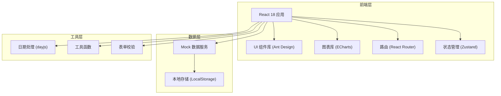

## 1. 架构设计



## 2. 技术选型说明

- **前端框架**: React@18 + TypeScript，提供类型安全和组件化开发
- **构建工具**: Vite@5，快速的开发体验和构建速度
- **UI 组件库**: Ant Design@5，企业级组件库，适合中后台系统
- **图表库**: ECharts@5，功能强大的数据可视化
- **路由**: React Router Dom@6，声明式路由管理
- **状态管理**: Zustand@4，轻量级状态管理方案
- **日期处理**: dayjs，轻量的日期处理库
- **样式方案**: Tailwind CSS@3 + CSS Modules 结合使用
- **Mock 数据**: 内置 Mock 数据，无需后端即可演示完整功能

## 3. 路由定义

| 路由路径 | 页面名称 | 说明 |
|----------|----------|------|
| /dashboard | 经营看板 | 首页，销售和客流数据展示 |
| /prescription | 处方审核 | 处方登记、审核列表、智能审查 |
| /member | 会员服务 | 会员查询、购药记录、用药提醒 |
| /inventory | 库存效期 | 效期预警、处理清单、库存查询 |
| /chronic | 慢病随访 | 慢病档案、随访记录、依从性分析 |
| /promotion | 促销活动 | 活动创建、商品配置、效果统计 |
| /compliance | 合规检查 | 自查管理、整改管理、台账导出 |

## 4. 目录结构

```
src/
├── components/          # 公共组件
│   ├── Layout/         # 布局组件
│   ├── StatCard/       # 统计卡片
│   ├── DataTable/      # 数据表格
│   └── StatusTag/      # 状态标签
├── pages/              # 页面组件
│   ├── Dashboard/
│   ├── Prescription/
│   ├── Member/
│   ├── Inventory/
│   ├── Chronic/
│   ├── Promotion/
│   └── Compliance/
├── store/              # 状态管理
│   └── index.ts
├── mock/               # Mock 数据
│   ├── dashboard.ts
│   ├── prescription.ts
│   ├── member.ts
│   ├── inventory.ts
│   ├── chronic.ts
│   ├── promotion.ts
│   └── compliance.ts
├── utils/              # 工具函数
│   ├── format.ts
│   └── validate.ts
├── types/              # TypeScript 类型定义
│   └── index.ts
├── App.tsx
├── main.tsx
└── index.css
```

## 5. 数据模型

### 5.1 核心数据类型

```typescript
// 处方类型
interface Prescription {
  id: string;
  patientName: string;
  patientAge: number;
  patientGender: 'male' | 'female';
  diagnosis: string;
  drugs: PrescriptionDrug[];
  doctor: string;
  createTime: string;
  status: 'pending' | 'approved' | 'rejected';
  warnings: WarningItem[];
}

// 会员类型
interface Member {
  id: string;
  name: string;
  phone: string;
  memberLevel: 'normal' | 'silver' | 'gold' | 'platinum';
  totalConsumption: number;
  purchaseRecords: PurchaseRecord[];
  medicationReminders: MedicationReminder[];
}

// 库存类型
interface InventoryItem {
  id: string;
  drugName: string;
  spec: string;
  batchNo: string;
  stock: number;
  expireDate: string;
  daysToExpire: number;
  status: 'normal' | 'warning' | 'urgent';
}

// 慢病档案类型
interface ChronicRecord {
  id: string;
  patientName: string;
  diseaseType: 'hypertension' | 'diabetes' | 'other';
  followUpRecords: FollowUpRecord[];
  medicationAdherence: number;
}

// 促销活动类型
interface Promotion {
  id: string;
  name: string;
  type: 'discount' | 'fullReduce' | 'buyGift';
  startTime: string;
  endTime: string;
  products: PromotionProduct[];
  status: 'draft' | 'active' | 'ended';
}

// 合规检查类型
interface ComplianceCheck {
  id: string;
  checkName: string;
  checkItems: CheckItem[];
  status: 'pending' | 'inProgress' | 'completed';
  rectificationPhotos: string[];
}
```

## 6. 状态管理设计

使用 Zustand 管理全局状态：

```typescript
interface AppState {
  // 用户信息
  user: User | null;
  
  // 当前选中的处方/会员/药品等
  selectedPrescription: Prescription | null;
  selectedMember: Member | null;
  
  // UI 状态
  sidebarCollapsed: boolean;
  
  // Actions
  setSelectedPrescription: (p: Prescription | null) => void;
  setSelectedMember: (m: Member | null) => void;
  toggleSidebar: () => void;
}
```
